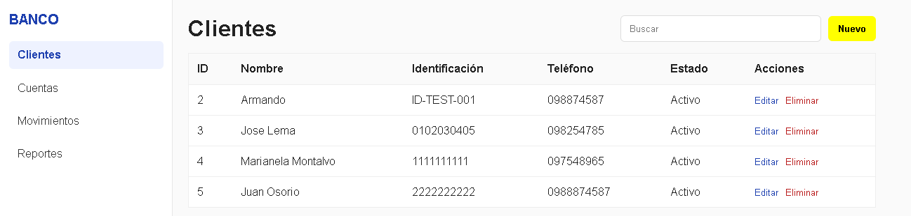
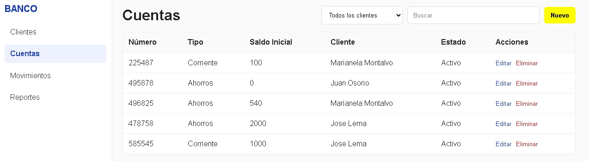
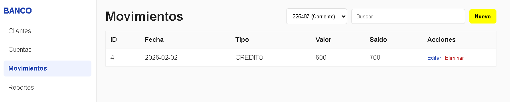
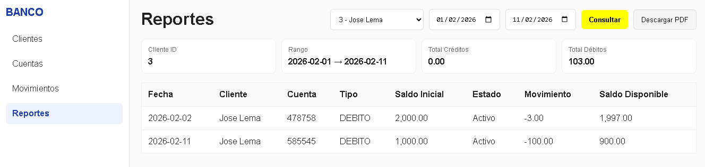

# 🏦 Devsu Bank - FrontEnd

Aplicación frontEnd desarrollada en Angular 17 utilizando Standalone Components y Lazy Loading, como parte de una arquitectura FullStack basada en Spring Boot (Java 17) y Angular.

El proyecto implementa una estructura modular por capas, consumo de APIs REST mediante HttpClient, formularios reactivos con validaciones, manejo de errores HTTP y generación de reportes con descarga de PDF, siguiendo principios de Clean Code y Separation of Concerns

Permite la gestión completa de:

- 👤 Clientes
- 💳 Cuentas
- 💰 Movimientos
- 📊 Reporte de Estado de Cuenta (incluye descarga PDF)

---

# 🚀 Stack Tecnológico

- Angular 17 (Standalone + Lazy Loading)
- TypeScript
- Standalone Components
- Lazy Loading con `loadComponent()`
- Reactive Forms
- HttpClient
- CSS puro (sin frameworks UI)
- Proxy para integración backend
- Arquitectura modular por capas

---

# 📦 Arquitectura

El proyecto sigue una separación  por capas:
```text
src/app/
├── core/
│ ├── models/
│ ├── services/
│
├── pages/
│ ├── clientes/
│ ├── cuentas/
│ ├── movimientos/
│ ├── reportes/
│
├── layout/
│
├── app.routes.ts
```

# Diagrama de Arquitectura  FrontEnd
```bash
🌐 Usuario / Browser
      │
      ▼
🚀 [Angular Router] ---- (Gestión de rutas)
      │
      ▼
🖼️ [LayoutComponent] --- (Sidebar, Navbar, Footer)
      │
      ▼
📂 [Pages] (Lazy Loading activado ⚡)
      ├── 👥 Clientes
      ├── 💰 Cuentas
      ├── 💸 Movimientos
      └── 📊 Reportes
      │
      ▼
⚙️ [Core Layer]
      ├── 📡 Services (HttpClient / API Calls)
      └── 📄 Models (Interfaces & DTOs)
      │
      ▼
🔗 [Proxy Configuration] (proxy.conf.json)
      │
      ▼
🍃 [Spring Boot API] (RESTful Backend)

```


# Principios aplicados
```bash
✔ Clean Code  
✔ Single Responsibility  
✔ Separation of Concerns  
✔ Lazy Loading  
✔ Standalone Components  
✔ Validaciones reactivas  
✔ Manejo de errores HTTP 
```

#  Configuración y Ejecución

## 1️⃣ Instalar dependencias

```bash
npm install
```

## 2️⃣ Ejecutar aplicación

```bash
npm start
```
La aplicación estará disponible en:

``` link
http://localhost:4200
```
⚠️ El backend debe estar ejecutándose en:
```
 http://localhost:8080
```
El proxy /api está configurado en proxy.conf.json.


## 2️⃣ Ejecutar los Test

```bash
npm start
npm run test:coverage
```
# 📡 Endpoints Consumidos
```

| Módulo       | Método | Endpoint                               |
| ------------ | ------ | -------------------------------------- |
| Clientes     | GET    | /api/clientes                          |
| Clientes     | POST   | /api/clientes                          |
| Clientes     | PUT    | /api/clientes/{id}                     |
| Clientes     | DELETE | /api/clientes/{id}                     |
| Cuentas      | GET    | /api/cuentas                           |
| Cuentas      | POST   | /api/cuentas                           |
| Cuentas      | PUT    | /api/cuentas/{id}                      |
| Cuentas      | DELETE | /api/cuentas/{id}                      |
| Movimientos  | GET    | /api/movimientos/cuenta/{numeroCuenta} |
| Movimientos  | POST   | /api/movimientos                       |
| Movimientos  | PUT    | /api/movimientos/{id}                  |
| Movimientos  | DELETE | /api/movimientos/{id}                  |
| Reportes     | GET    | /api/clientes/{clienteId}/reportes     |
| Reportes PDF | GET    | /api/clientes/{clienteId}/reportes/pdf |
```


# 🧪 Funcionalidades Implementadas
👤 Clientes
- Listado
- Búsqueda rápida
- Crear
- Editar
- Eliminar
- Validaciones visuales
- Manejo de errores backend

💳 Cuentas

- Listado
- Búsqueda rápida
- Crear cuenta
- Editar cuenta
- Eliminar cuenta

💰 Movimientos

- Filtrado por cuenta
- Crear movimiento (CREDITO | DEBITO)
- Edición con validación de fecha (requerida por backend)
- Manejo correcto de valores BigDecimal
- Normalización de LocalDate
- Manejo de 400 Bad Request
- Eliminación


📊 Reporte Estado de Cuenta

- Filtro por cliente
- Rango de fechas
- Totales calculados (Créditos y Débitos)
- Visualización en tabla
- Descarga PDF (Base64 > Blob > archivo descargable)


## 📸 Capturas de Pantalla

 
 
 
 


# 🧠 Decisiones Técnicas
- Se utilizó arquitectura standalone para reducir boilerplate.
- Se implementó Lazy Loading por página.
- Se manejaron errores 400 provenientes del backend.
- Se respetaron los DTO del backend (BigDecimal, LocalDate).
- Se implementó descarga segura de PDF desde base64.
- No se utilizaron frameworks de estilos

# 🔐 Validaciones
- Formularios con ReactiveForms.
- Validación de rango de fechas.
- Validación de valor mínimo en movimientos.
- Manejo de errores de negocio enviados por backend.

# 📌 Consideraciones
- El backend debe estar levantado previamente.
- Se recomienda usar Node 18+.

# 🏁 Estado del Proyecto
✔ Implementación completa

✔ CRUD funcional en todas las entidades

✔ Reporte con generación PDF

✔ Código limpio y estructurado

# Mejoras Futuras
- Unit Testing (Jest / Karma)
- Manejo global de errores con interceptor
- Guards de autenticación
- Paginación en tablas
- Filtros avanzados
- Exportación CSV
- Dckerización del frontend


# ✍️ Autor

| **Armando Haro** | Data Engineer • Backend Developer |
| :--- | :--- |
| **Tech Stack** | Java • Spring Boot • Microservices • Kafka • Python •  Pyspark • Azure • Databricks • AWS • Datio • Collibra • Data Factory • SQL • DBT
| **GitHub** | [github.com/armandoharo1](https://github.com/armandoharo1) |
